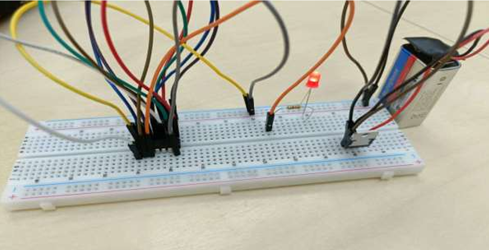

# 🔲 4-Bit Even Parity Checker  

## 📌 Overview  
This project demonstrates the design and hardware implementation of a **4-bit Even Parity Checker**.  
The focus is on **error detection in digital systems** using logic circuits, supported by theory, hardware setup, and documentation.  

📎 Documentation → `Documentation.pdf`  
📎 Presentation → `4-bit even parity checker.pptx`  
📠Hardware Setup →   

---

## 🧾 What is Even Parity?  
Even parity is a simple **error detection method**.  
- If the number of 1s in a 4-bit input is **even**, the parity bit = **0**.  
- If the number of 1s is **odd**, the parity bit = **1**.  

This ensures the total number of 1s is always **even**, helping detect single-bit errors during transmission.  

---

## 🛠 Features Covered  
- Explanation of **Even Parity** and **Error Detection Codes**  
- Truth Table, K-Map, and Boolean Algebra  
- Logic circuit diagram & simulator output  
- Hardware implementation with components  

---

## ⚡ Hardware Components  
- IC 4070 (XOR gate)  
- Breadboard  
- Jumper wires  
- DIP switch  
- Voltage regulator 7805 IC  
- LED  
- Resistors  
- Battery  

---

## 👨‍💻 Contributors  
- **Mina Atef**  
- **Aya Hisham**  
- **Amgad Mamdouh**  
---
## 📝 Note  
This project was completed as part of the **Digital Logic Gates** course.  
**Final Grade: B+**

---
